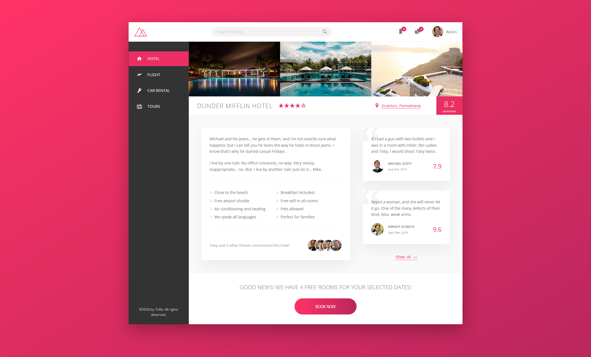

# Trillo 🔺🔻
Second project of [Advanced CSS and Sass Udemy course](https://www.udemy.com/course/advanced-css-and-sass/) by [Jonas Schmedtmann](https://codingheroes.io/)

Built entirely with Flexbox

### [Live Demo](https://mat2ja.github.io/trillo/)

I added some extra stuff like my own mobile layout, animated figcaption in the gallery section and a dropdown user menu on hover. Also replaced all lorem and users with Office stuff. 
